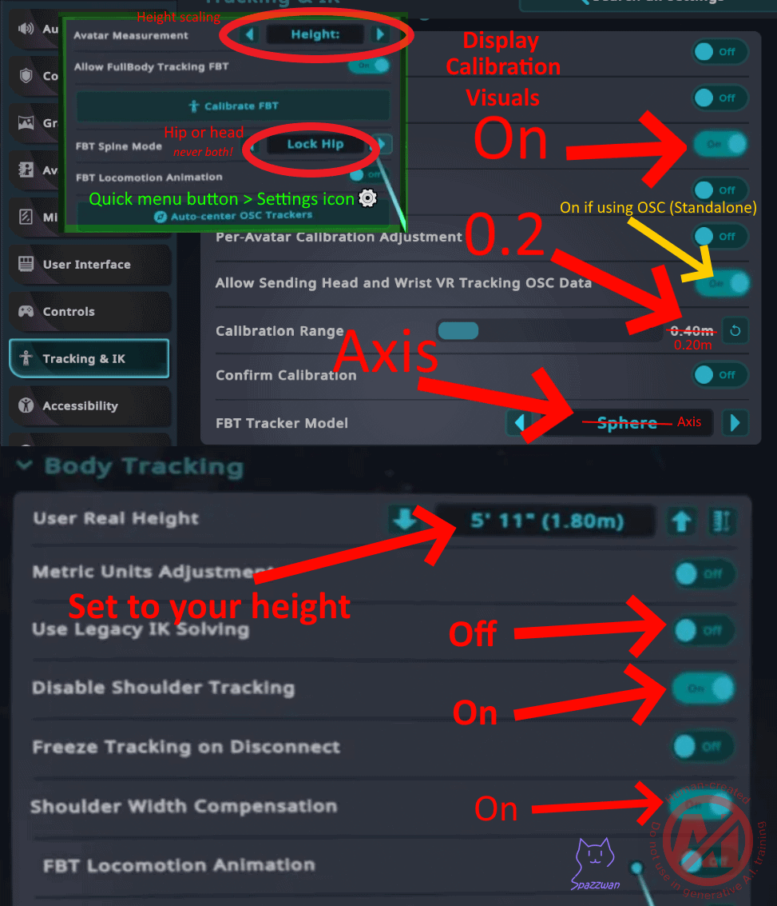
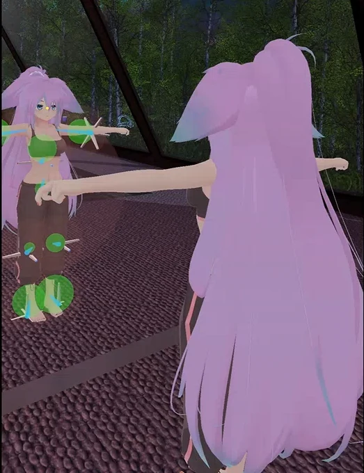
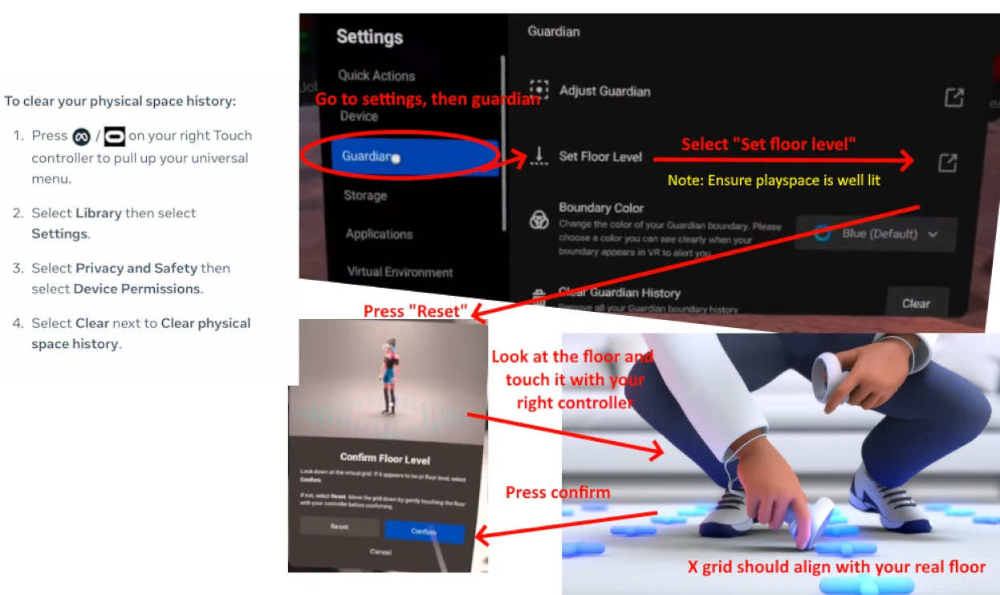

VRChat is the most common game IBIS users play (ChilloutVR, Resonite, Blade & Sorcery, and anything else that accepts Vive-style trackers work too). A few VRChat-specific settings make full-body feel right.

## In-game settings

Open VRChat → **Settings** → **Tracking & IK**:

| Setting | Recommendation |
|---|---|
| User Real Height | Your actual standing height. VRChat uses this to scale your avatar; it should match the height set in SlimeVR. |
| Avatar Measurement | **Height** |
| Allow FullBody Tracking (FBT) | On |
| FBT Spine Mode | **Lock Hip** for most avatars (or **Lock Head** — never both). |
| FBT Locomotion Animation | Off (lets your tracking drive walking instead) |
| Display Calibration Visuals | On — shows the tracker gizmos while calibrating |
| Per-Avatar Calibration Adjustment | 0.2 |
| Calibration Range | 0.20 m |
| FBT Tracker Model | **Axis** — makes it obvious which way each tracker is facing |
| Use Legacy IK Solving | Off |
| Disable Shoulder Tracking | On |
| Shoulder Width Compensation | On |
| Allow Sending Head and Wrist VR Tracking OSC Data | On if you play standalone via OSC, otherwise off |

*Infographic by [Spazzwan](https://imgur.com/a/PCYz9Zw), used with permission.*

## Calibrate in VRChat

Every avatar needs calibration the first time you wear it:

1. Wear the avatar
2. Hold both triggers + grips (the calibration menu pops up)
3. Stand in **T-pose** with your hands aligned to the avatar's wrist gizmos, feet 5–10 cm apart and parallel
4. Confirm

You should look like yourself. If a limb is way off:

- Knees bend backward → mounting is wrong on that thigh tracker, re-run [Mounting Calibration](/slimevr-server/mounting-calibration/)
- Avatar is the wrong height → fix your **Real Height** setting in VRChat
- Feet sink into the floor → fix **foot height** in [Body Proportions](/slimevr-server/body-proportions/)

### Checking your proportions

SlimeVR can cross-check your VRChat settings: **Settings → VRChat Config Warnings** lists every value that disagrees with SlimeVR, and the height row should match your real height in both columns. With **FBT Tracker Model** set to Axis, your ankle trackers' horizontal axis lines should sit just above the floor grid — not under it, not floating.

*Infographic by [Spazzwan](https://imgur.com/a/PCYz9Zw), used with permission.*

## Reset etiquette in VRChat

Yaw-reset whenever your avatar's facing drifts off real-world. Full reset between worlds or after long sits.

If you're using [Stay Aligned](/firmware/stay-aligned/), yaw drift will be much lower and you can mostly forget about manual yaw resets.

## VRChat on Quest standalone

See [SteamVR & OSC](/slimevr-server/steamvr-and-osc/) for the OSC setup that gets IBIS trackers into Quest-standalone VRChat.

If your avatar's height or floor is off on Quest, reset the headset's floor level: **Settings → Guardian → Set Floor Level**, then look at the floor and touch it with the right controller so the grid sits on your real floor. Clearing the physical space history (Settings → Privacy and Safety → Device Permissions → Clear physical space history) fixes stubborn cases.

*Infographic by [Spazzwan](https://imgur.com/a/PCYz9Zw), used with permission.*

## Common VRChat-specific gotchas

- **"My feet are crossing through each other"** — bone proportions are off. Re-check your height and re-apply [Body Proportions](/slimevr-server/body-proportions/).
- **"My avatar is leaning forward"** — your hip tracker is too high or rotated wrong. Check [Wearing Trackers](/straps/wearing-trackers/) and re-run mounting calibration.
- **"My head moves but body doesn't follow"** — SteamVR isn't seeing the trackers. See [Trackers Not Showing in SteamVR](/troubleshooting/steamvr-not-showing/).
