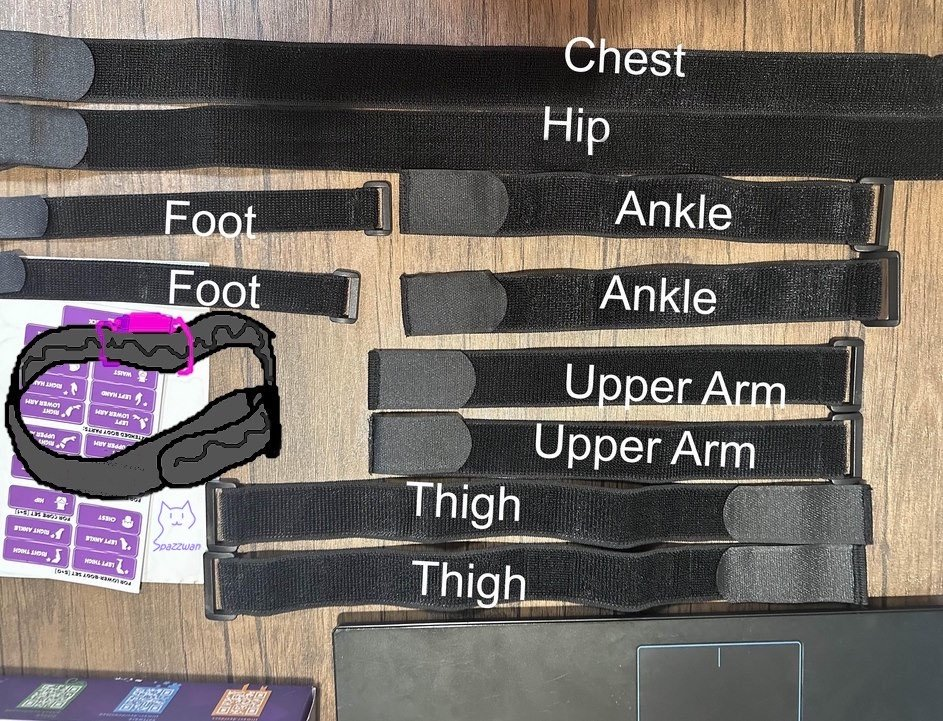
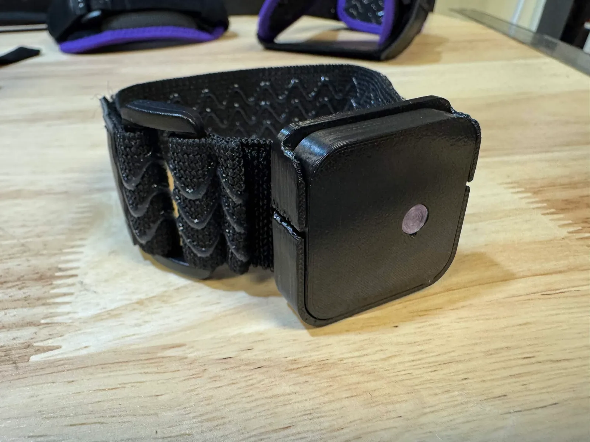
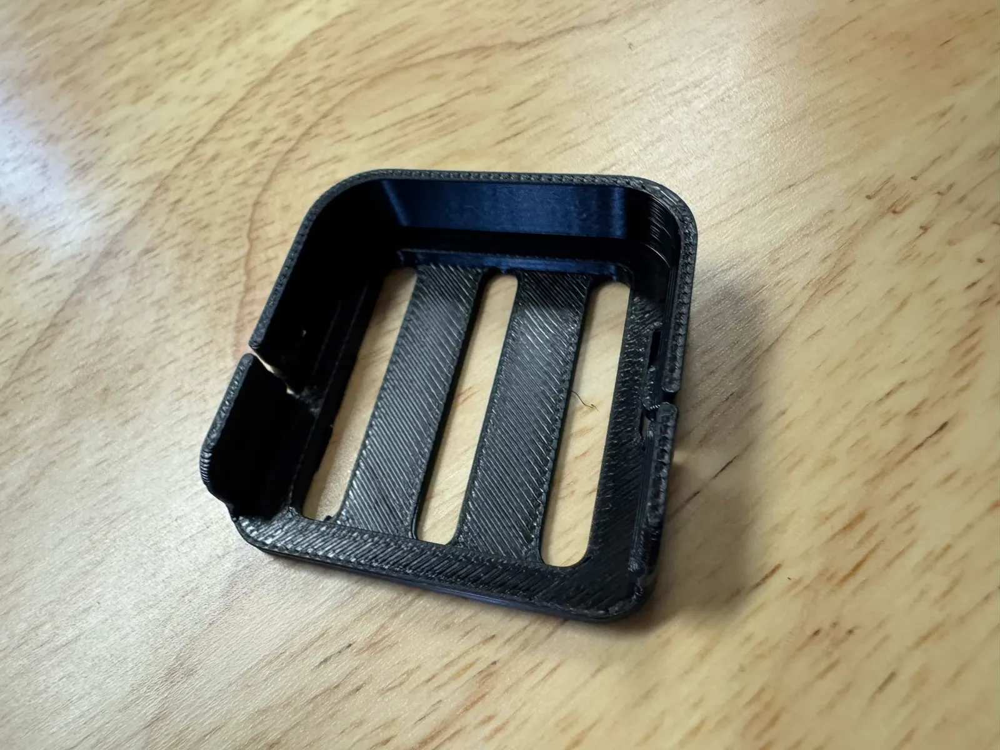

Before you start, lay everything out on a flat surface and check it against the list for the kit you ordered. If anything is missing or damaged, reach out via [support](/support/) before you start charging or pairing.

## Standard IBIS sets (Core / Advanced / Full Body)

The three standard sets ship with identical contents apart from the tracker count and the strap pack:

- **IBIS trackers** — 6 (Core), 8 (Advanced), or 10 (Full Body)
- **2 sheets of placement stickers** (10 per sheet) for labelling trackers by body part
- **A5 quick-start card** pointing at [vyrovr.com/setup](https://vyrovr.com/setup)
- **10-port USB-C charging dock** + USB-A to USB-C cable
- **USB receiver** + **1.5 m USB extension cable** (USB-A male to USB-A female). The receiver design varies by batch — see [Installing the Receiver](/receiver/installing/) to identify yours.
- **Chest harness with tracker mount**, plus one spare mount
- **Basic strap pack** — silicone-backed hook-and-loop straps:
  - 2 × 30 cm ankle straps
  - 2 × 45 cm thigh straps
  - 1 × 110 cm hip strap
  - Advanced and Full Body add 2 × 30 cm foot straps
  - Full Body adds 2 × 30 cm arm straps
- **10 mounting trays** and **10 quick-release hooks** (one per tracker, plus spares on the smaller sets)
- Occasional spare parts, depending on the run

Straps are 30 mm wide; the current strap pack uses narrower 25 mm straps for feet and ankles. Assembly is covered in [Basic Straps & Trays](/straps/basic-straps/).

*Infographic by [Spazzwan](https://imgur.com/a/PCYz9Zw), used with permission.*

| Tracker in a tray on a strap | Chest harness tracker mount | 30 mm tray |
|---|---|---|
|  |  |  |

:::note[What each set covers]
**Core (6):** chest, hip, both thighs, both ankles. **Advanced (8):** Core + both feet. **Full Body (10):** Advanced + both upper arms.
:::

## IBIS Lite Edition (6 trackers)

The Lite Edition is a stripped-back starter set. It includes:

- 6 × IBIS trackers
- 2 large, 2 medium, and 2 small basic straps
- USB receiver + cable
- 6 mounting trays + 1 spare, 6 quick-release hooks + 1 spare

It does **not** include the charging dock, the chest harness, or placement stickers. Charge Lite trackers one at a time with any USB-C cable — see [Charging](/charging-and-battery/charging/). If you want a chest tracker, the [Chest Harness Lite](/straps/chest-harness/) is sold separately.

## IBIS Premium sets

Premium sets swap the basic strap pack for **VYRO VR comfort straps** (also called **premium straps** — same product, see [Comfort / Premium Straps](/straps/comfort-strap/)) and ship with a **Styria receiver** pre-paired to the trackers. In the box:

- 6 / 8 / 10 × IBIS trackers, stickers, trays, and hooks as above
- 10-port charging dock + USB-C cable
- Styria receiver + USB-A extension cable
- **VYRO VR Chest Harness** (fits up to 135 cm around the chest)
- **VYRO VR Hip Harness** (up to 160 cm)
- 2 × **VYRO VR Thigh Straps** (up to 85 cm)
- 2 × **VYRO VR Ankle/Arm Straps** (up to 45 cm)
- Advanced and Full Body: 2 × 35 cm basic foot straps
- Full Body: 2 × VYRO VR Arm Straps

## Upgrade kits (sold separately)

If you added an upgrade kit to your order, it ships in its own bag:

- **Foot Tracker Upgrade Kit** — 2 trackers + 2 × 30 cm basic straps (also fine for arms)
- **Arm Tracker Upgrade Kit** — 2 trackers + 2 VYRO VR comfort arm straps (a basic-strap variant is also sold)
- Both kits are offered with or without a **Styria receiver**. If you bought the no-receiver variant, the new trackers must be paired to your existing receiver and run the same firmware version — see [Pairing](/trackers/pairing/).
- **VYRO VR Comfort Strap Bundles** (Core / Advanced / Full Body / Essential) — comfort straps that replace your basic straps; trackers not included

## A note on charge state

Trackers ship near fully charged, but a button can get pressed in transit and wake a tracker up. It's normal for one or two to need a top-up before first use. See [Charging](/charging-and-battery/charging/).

:::note
If you're not sure which piece is which, ask in the [Discord](https://discord.gg/vyrovr) — someone will point it out.
:::
