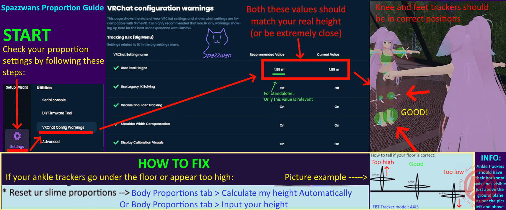

A tracker only knows its rotation. To turn that into "your knee is here," the server needs to know the length of your femur, your tibia, your spine, etc. That's **body proportions**.

Wrong body proportions = avatar mismatch (legs too short, feet sinking into the floor, head poking through ceilings). Right body proportions = it just feels right.

## Recommended: automatic proportions from your height

SlimeVR can derive a full set of bone lengths from a single number — your height — using average human proportions. It's quick, repeatable, and for the vast majority of people it's more reliable than recording-based calibration. This is the method VYRO VR recommends.

1. In the SlimeVR window, open **Body proportions** and stay on the **Automatic** tab.
2. Either click **Calculate my height automatically** — put your headset on, stand up straight, look forward, and hold still for a moment while the server reads your headset height — or type your real height into the height field.
3. Check the height it shows against what you know you are. If it's more than a centimetre or two off, type in the correct value.
4. Click **Apply** (or **Save**, depending on server version). The server scales every bone to match.

That's it. Use the same height in VRChat's **User Real Height** setting so the two agree — SlimeVR's **Settings → VRChat Config Warnings** will flag it if they don't.

*Infographic by [Spazzwan](https://imgur.com/a/PCYz9Zw), used with permission.*

## Fine-tuning

After applying the height-based proportions, jump in VR and check:

- **Standing height** — your virtual eyes should be at your real-world eye height when you stand straight
- **Feet on the floor** — they should sit on the floor, not below or above it. With VRChat's tracker model set to Axis, the ankle trackers' horizontal axis line should sit just above the floor grid. Adjust **foot height** if not.
- **Hips** — should bend where your real hips do. If your avatar's legs feel detached from your torso, tweak **torso** length.

For adjustments, switch to the **Manual** tab and nudge individual bones a centimetre at a time. Small adjustments make a big visual difference. Iterate.

## Other methods

- **Manual** — enter every bone length from a tape measure. Useful if you have unusual proportions and know your numbers; otherwise start from the height-based result and only tweak what's wrong.
- **AutoBone** — records you walking and squatting and fits bone lengths to the recording. It's still in the server, but VYRO VR no longer recommends it: results vary a lot with tracker placement and headset tracking quality, and a bad recording is worse than the height-based defaults. If you try it, check the result against your real height afterwards.

## When to redo it

- After significant weight change
- After switching to different shoes (height differences matter — re-measure or re-enter height)
- After remounting straps in a different position on your limbs (then re-check foot height and torso)

## More

Upstream reference: [SlimeVR Body Proportions Configuration](https://docs.slimevr.dev/server/body-config.html).
