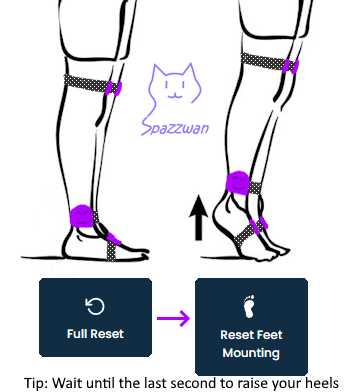

Mounting calibration tells the server **which way each tracker is rotated on your body**. Without it, the server has no way to know whether the USB port is facing toward your foot, the floor, or your nose.

Run this once after assigning trackers to body parts, and again any time you remount a tracker in a different orientation.

## Through the setup wizard

The wizard prompts you through the calibration automatically. Strike the poses it asks for and click through.

## Manually

In the **Trackers** sidebar, choose **Mounting calibration**. The server will guide you through a standing pose, then a brief check pose. It only takes 10-15 seconds.

## Two ways to calibrate

There are two flavors of mounting calibration:

### Automatic (recommended)

Stand up straight, arms at your sides, facing forward. Click **Start**. The server reads the orientation of every tracker against your headset's facing direction and stores it. Done.

This is fast, accurate, and almost always what you want.

### Manual mounting (per-tracker)

If one tracker is mounted unusually, the Trackers panel lets you set its mounting orientation by hand (front / back / left / right) instead of re-running the automatic routine for everything.

:::note[Not the same as side calibration]
Double-pressing a tracker's button starts **side calibration**, which is an IMU (gyro-bias) calibration done with the tracker resting on a flat surface. It has nothing to do with mounting orientation. See [IBIS Overview](/trackers/ibis-overview/#side-calibration-2-presses).
:::

## Foot trackers

Foot trackers get their own mounting pass. Do a **full reset**, then raise your heels onto your toes and trigger **Reset feet mounting** (bind it, or click it in the Trackers panel). Wait until the last second to raise your heels so the rest of your body is still in the neutral pose.

*Infographic by [Spazzwan](https://imgur.com/a/PCYz9Zw), used with permission.*

## When to re-run mounting calibration

- You took a tracker off and put it back on a different way
- A strap rotated during a session
- One body part feels "off" while the rest feel right (often a sign that single tracker shifted)
- You replaced a tracker

## Things that aren't mounting calibration

- **IMU / side calibration** — zeroes sensor bias; done at the factory and re-runnable from the tracker button (two presses, tracker on a flat surface). Only needed if one tracker drifts much faster than the rest.
- **Full reset** — re-zeros rotation but uses the existing mounting offsets. You'll do this many times per session.

For the deep technical version of IMU calibration, see the upstream [SlimeVR IMU calibration page](https://docs.slimevr.dev/server/imu-calibration.html).
