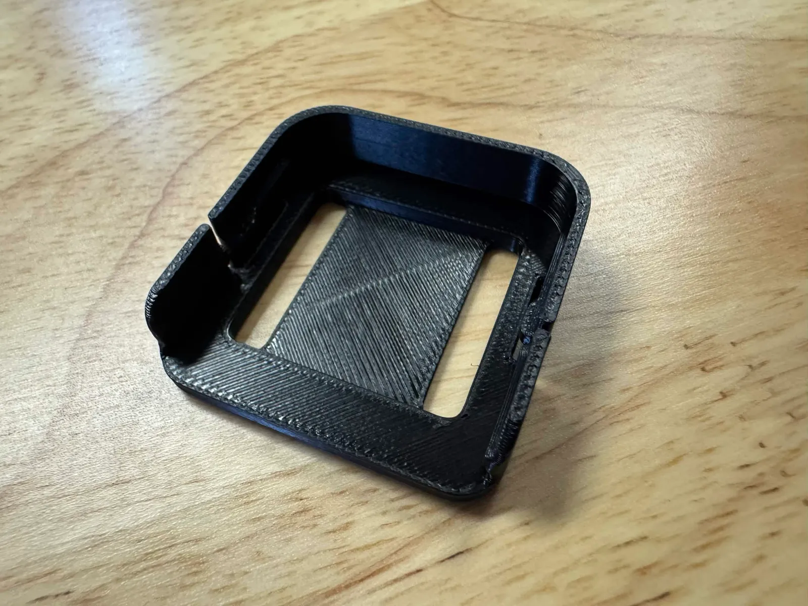
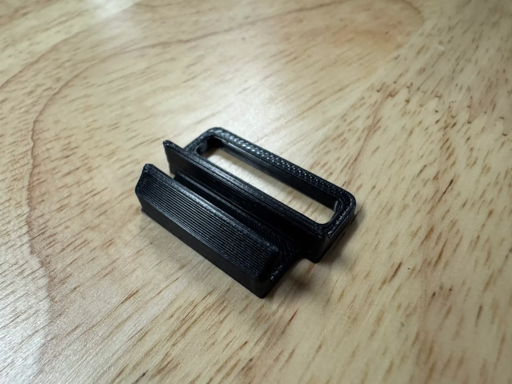
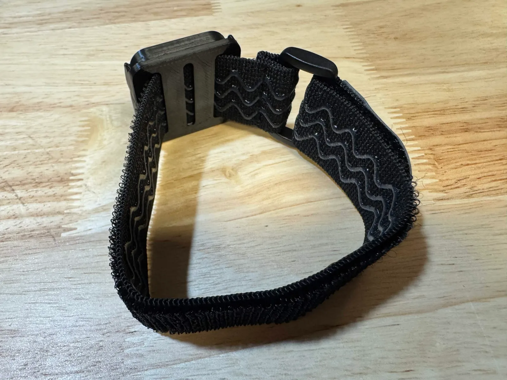
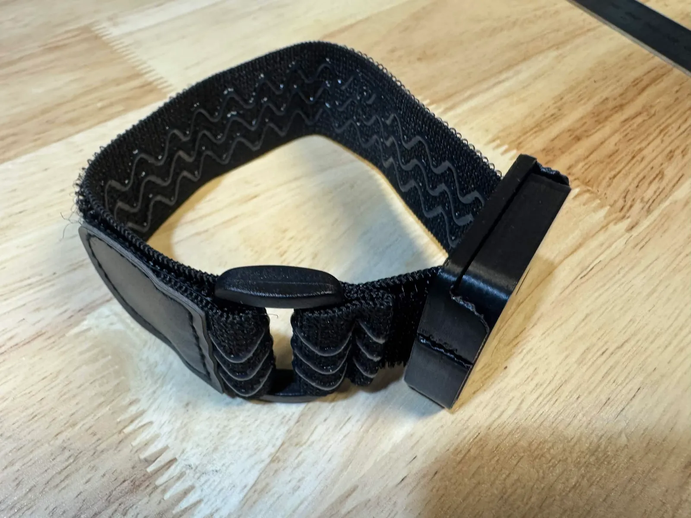

Every standard IBIS set (and the Lite Edition, the Foot Tracker Upgrade Kit, and the basic-strap Arm kit) ships with **basic straps**: silicone-backed hook-and-loop straps, a plastic **mounting tray** per tracker, and a **quick-release hook** per strap. This page is how to put them together. These steps mirror Step 4 of the [vyrovr.com setup guide](https://vyrovr.com/setup), which has photos.

If you have a Premium set or bought a Comfort Strap Bundle, see [Comfort / Premium Straps](/straps/comfort-strap/) instead.

## What's in a strap

- 1 × **hook-and-loop strap** — silicone-backed elastic, 30 mm wide (25 mm for the foot and ankle straps in the current pack). Lengths: 30 cm ankle/foot/arm, 45 cm thigh, 110 cm hip
- 1 × **mounting tray** — the square plastic frame the tracker slides into. There are two widths to match the straps: a **30 mm tray** with a single wide slot, and a **25 mm tray** with three slots for the narrower foot and ankle straps
- 1 × **quick-release hook** — the small open hook that lets you unclip the strap without undoing the velcro

| 30 mm tray | 25 mm tray | Quick-release hook |
|---|---|---|
|  |  |  |

The chest tracker doesn't use a strap; it clips onto the [chest harness mount](/straps/chest-harness/).

## Assemble a strap

1. Grab a hook, a tray, and a strap.
2. **Thread the strap through the tray with the silicone side facing away from the tray.**
3. **Thread the strap back through the tray.** The velcro (hook) side should now face up, and the silicone side faces your body.
4. **Attach the hook** to the plastic end of the strap, facing downward. Loop the velcro tail through the hook's loop and stick it down.
5. **Slide the tracker into the tray with the USB-C port facing down, into the tray.** The tracker can technically sit either way, but port-down keeps the button reachable and matches the orientation used throughout these docs.

If you've assembled it correctly, the strap is a loop with the tray on the outside, silicone against your skin, and a hook at one end for quick release.

| Tray end | Hook end |
|---|---|
|  |  |

## Wear the strap

1. Place the loop around the body part (ankle, thigh, upper arm, waist).
2. Clip the hook, then pull the velcro tail to adjust.
3. Tighten **firmly enough that the tracker doesn't shift** when you move, but **not so tight it's uncomfortable**. You should be able to slide a finger under the strap. See [Wearing Safely](/safety/wearing-safely/).
4. To take trackers off quickly (bathroom break, swapping with a friend), unclip the hook rather than undoing the velcro.

## Where each strap goes

See [Wearing Trackers](/straps/wearing-trackers/) for placement and orientation.

## Care

- Straps are **machine-washable on a cold cycle**. Pull the tray and hook off first.
- Wipe the silicone with a damp cloth between washes.
- Velcro picks up lint; pick it clean occasionally to keep its grip.
- Replacement trays and hooks are sold on [vyrovr.com](https://vyrovr.com) (Ibis Tracker Replacement Trays & Hooks), as are 6- and 10-strap packs.

## Troubleshooting

- **Tracker keeps shifting:** strap is too loose, or the silicone is facing the tray instead of your skin — re-thread it
- **Strap leaves a red mark after sessions:** too tight — back off until it just barely holds the tracker steady
- **Strap slides down (thigh):** move it to a part of the leg where flexing the muscle moves it least, or step up to a [comfort thigh strap](/straps/comfort-strap/), which is wider and longer
