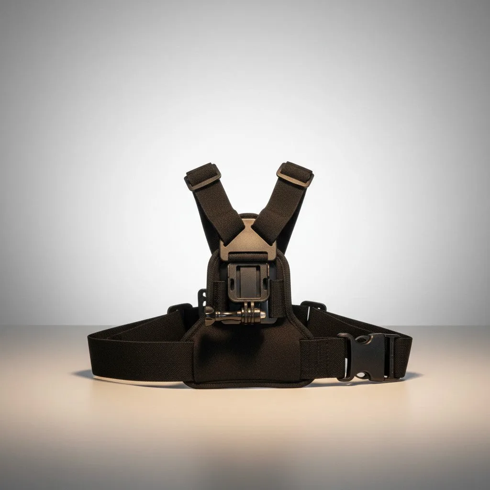
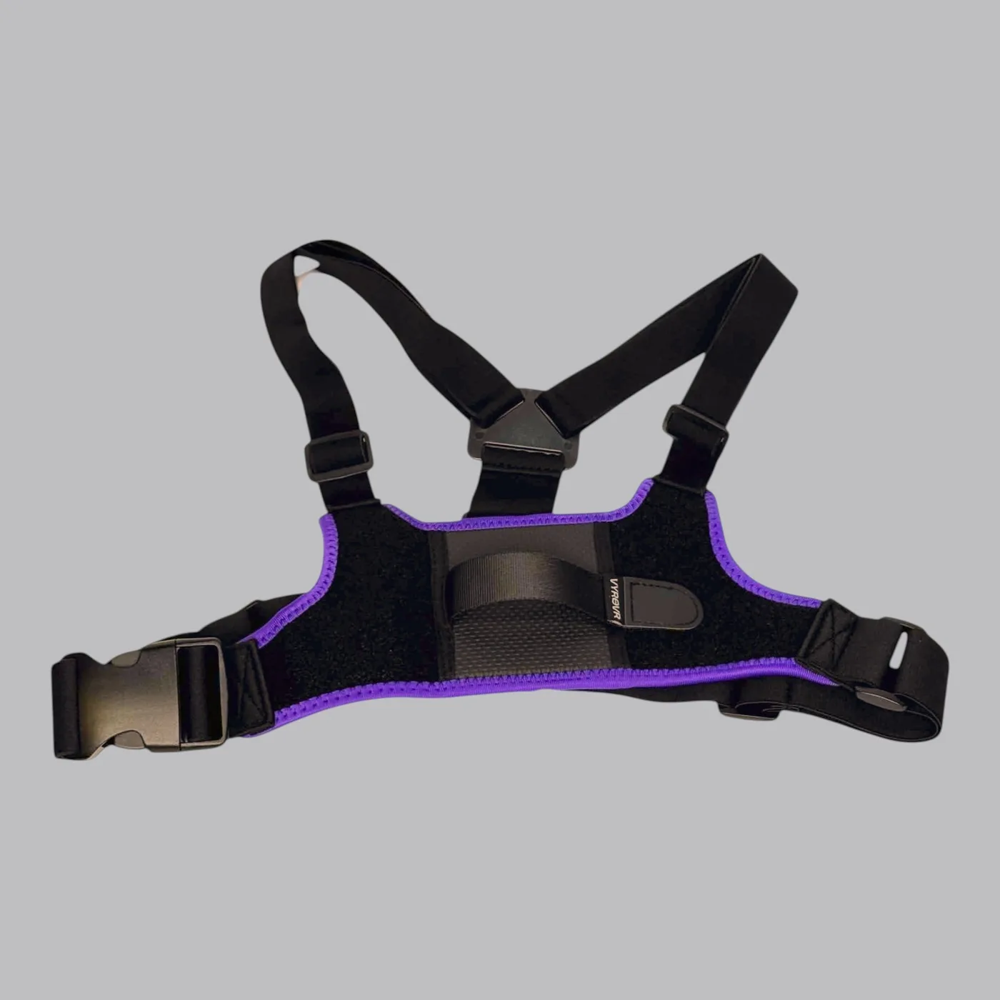
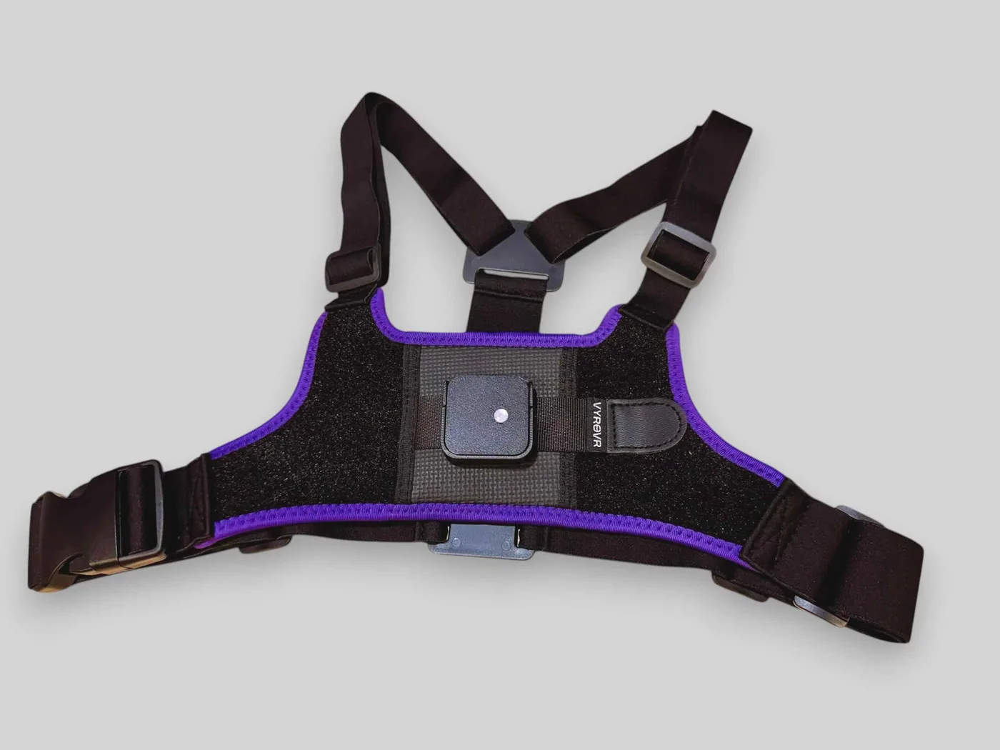
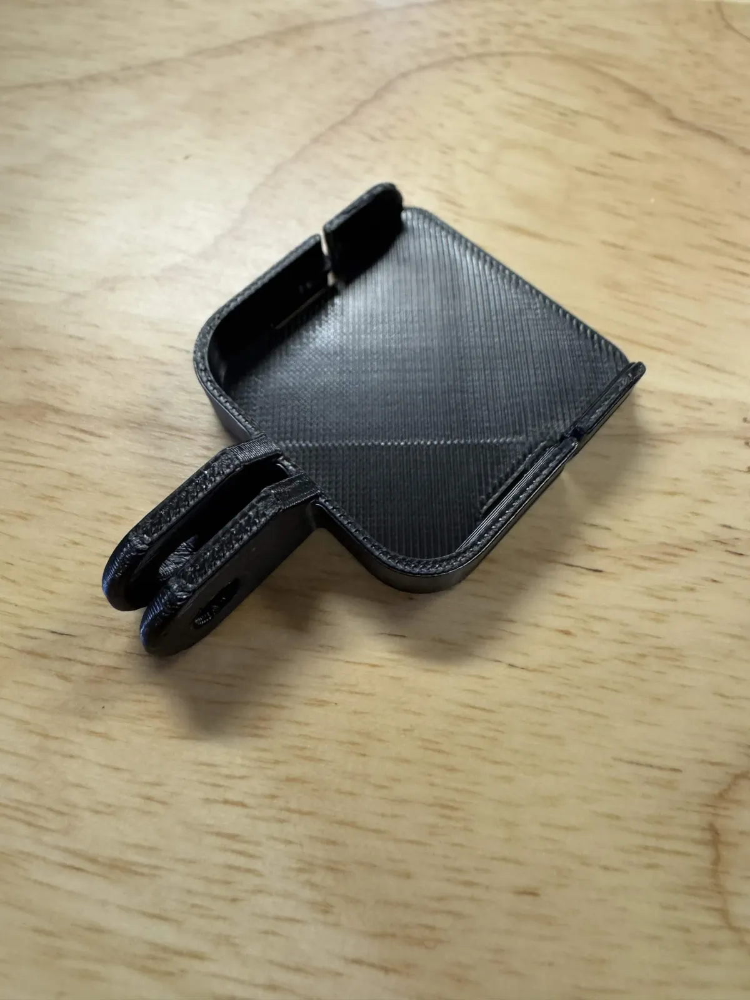
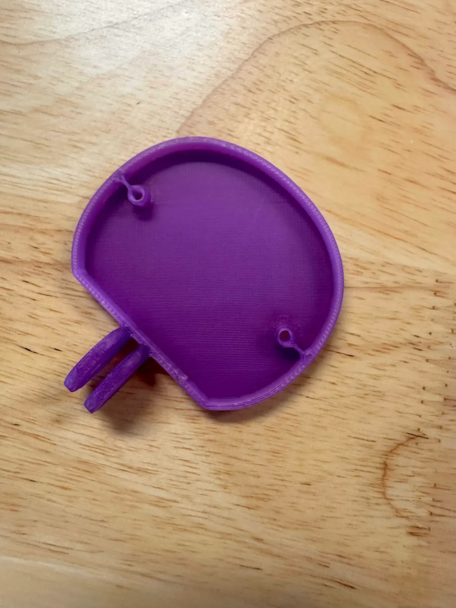
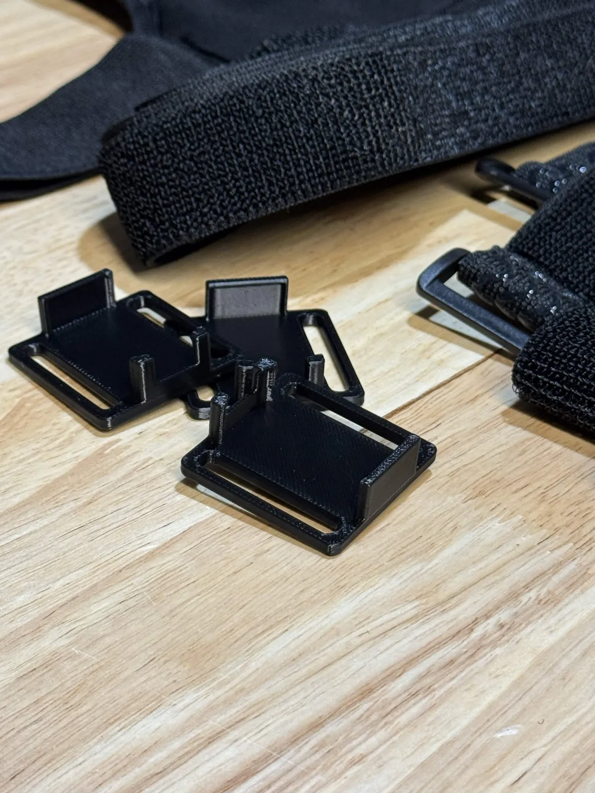
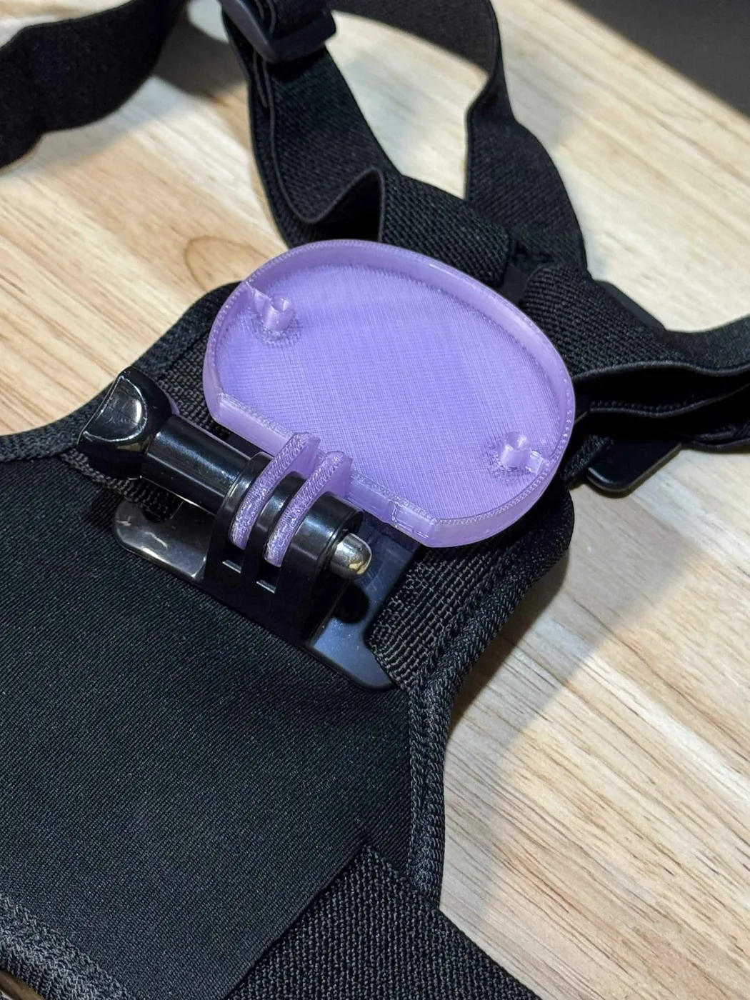

The chest tracker doesn't use a strap and tray. It clips onto a **mount** on a harness worn over the torso. Which harness you have depends on your kit:

| Harness | Comes with | Notes |
|---|---|---|
| **Standard chest harness** | Every standard IBIS set (Core / Advanced / Full Body) | Elastic harness with a tracker mount; a **spare mount** is in the box |
| **Chest Harness Lite** | Sold separately; bundled free with standard sets during promotions | Neoprene, adjustable on both sides and at the shoulders, quick-release buckle, 25 mm polyester tracker mount |
| **VYRO VR Chest Harness (Premium)** | Premium sets and Comfort Strap Bundles | As Lite, plus **back-mounting** support; fits up to 135 cm around the chest |

| Standard chest harness | Chest Harness Lite | Premium chest harness |
|---|---|---|
|  |  |  |

The Lite Edition set has no harness; the Chest Harness Lite is the usual add-on.

## The tracker mount

The harness carries a **mount** that clips onto the harness with a GoPro-style two-prong fork. The IBIS mount is a square tray with side rails that the tracker slides into, USB-C port down. A second bracket with the same fork fits an **official SlimeVR tracker** (remove the tracker's back plate, two screws, and screw it to the bracket), and a wider **extension bracket** takes the official SlimeVR extension tracker on a 30 mm strap if you use one on the hip.

| IBIS tracker mount | Official SlimeVR tracker bracket | SlimeVR extension bracket |
|---|---|---|
|  |  |  |

## Putting it on

1. **Loosen the shoulder and side adjusters**, then put the harness on like a vest with the tracker mount on the front.
2. **Position the mount high on the chest.** Higher is better — toward the upper chest, above the bust, never low on the ribs. Be consistent between sessions and re-run [mounting calibration](/slimevr-server/mounting-calibration/) if you move it.
3. **Tighten** until the harness doesn't ride up or down when you raise your arms or lean forward. Snug, not restrictive — you'll be breathing into it for hours.
4. **Fit the tracker into the mount** with the USB-C port pointing **down**. On the standard harness the mount is a slide-in clip like the strap trays; on the Lite and Premium harnesses the tracker sits under a polyester strap that you snug down.

## Where the chest tracker actually helps

A chest tracker dramatically improves leans, twists, and bending forward — the spine actually bends in VR instead of pivoting at the hip. For full-body VRChat or VR exercise, it's a real upgrade. For seated-only setups, it's optional.

## Care

- Harnesses are **machine-washable on a cold cycle**; take the tracker and mount off first and air dry.
- Wipe the tracker mount after sweaty sessions.
- If the elastic stretches out over time, replacement harnesses and mounts are available on [vyrovr.com](https://vyrovr.com) — or reach out via [support](/support/) if it's within the 1-year strap warranty.
