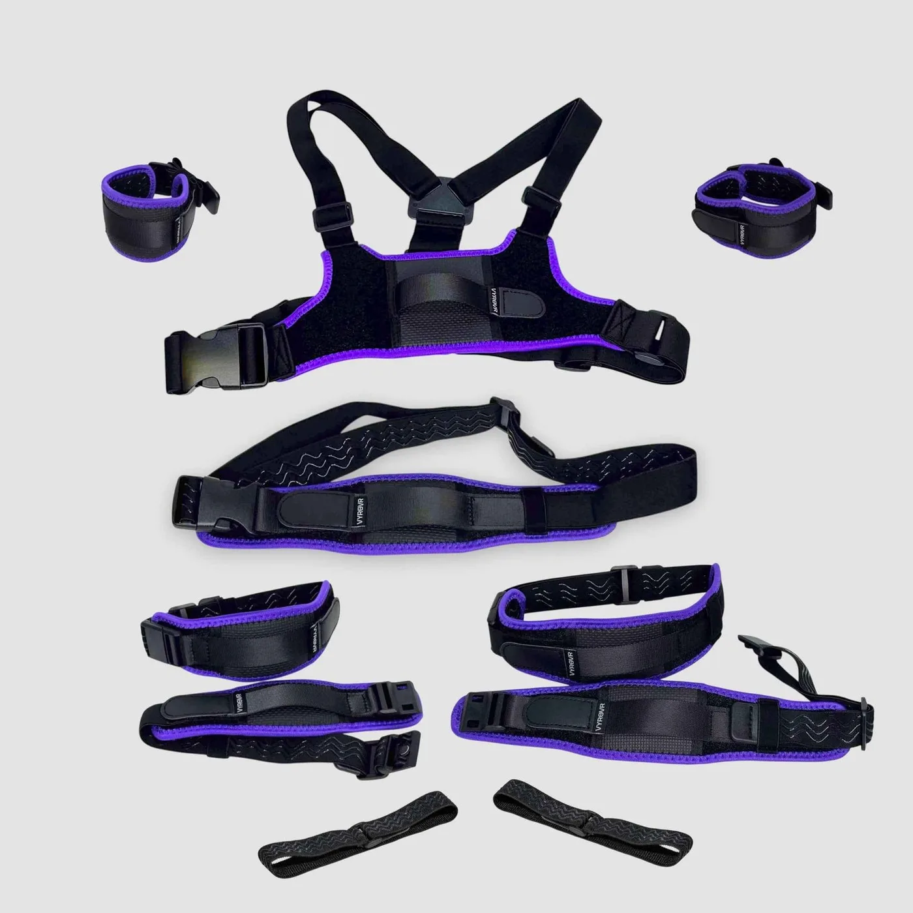
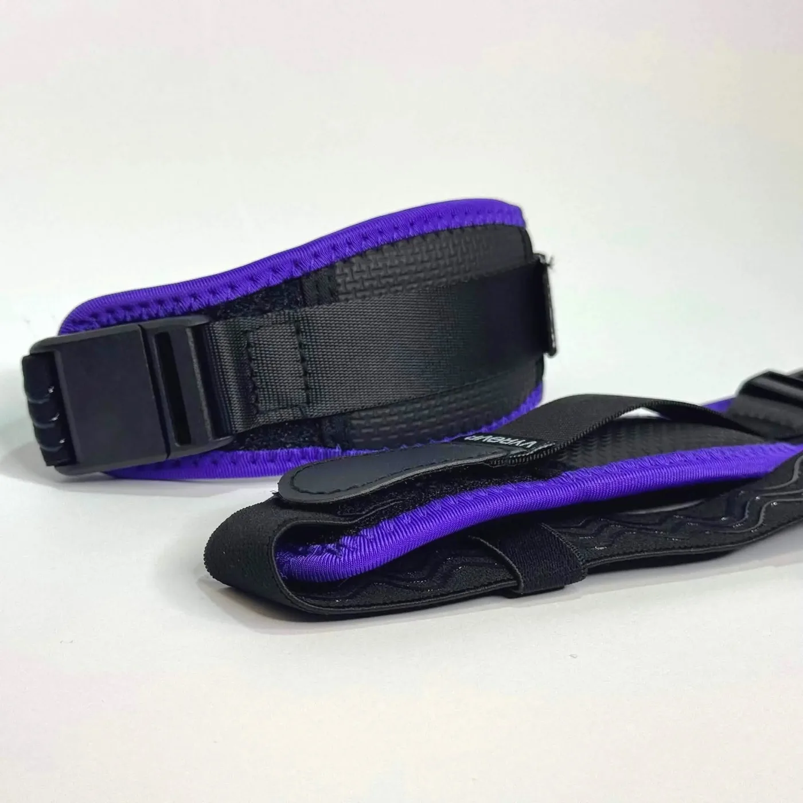
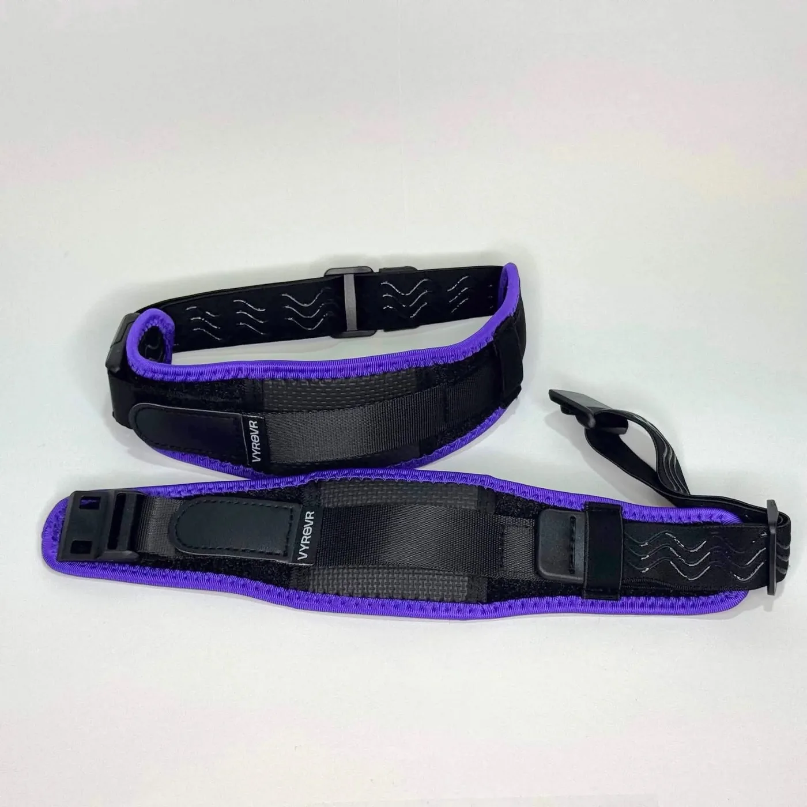
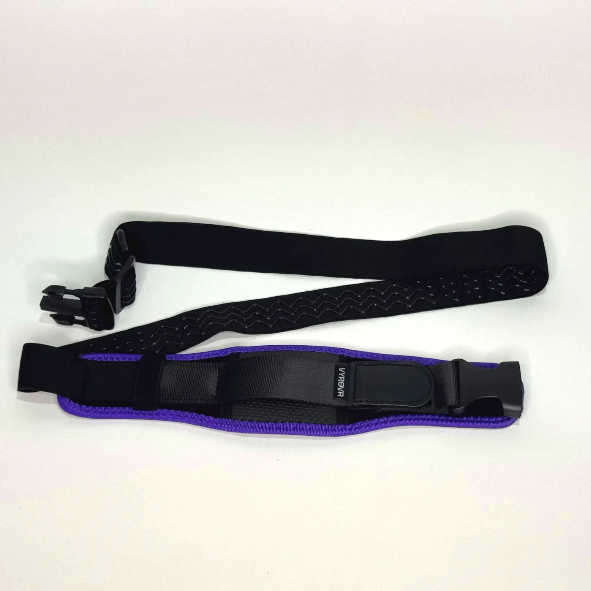
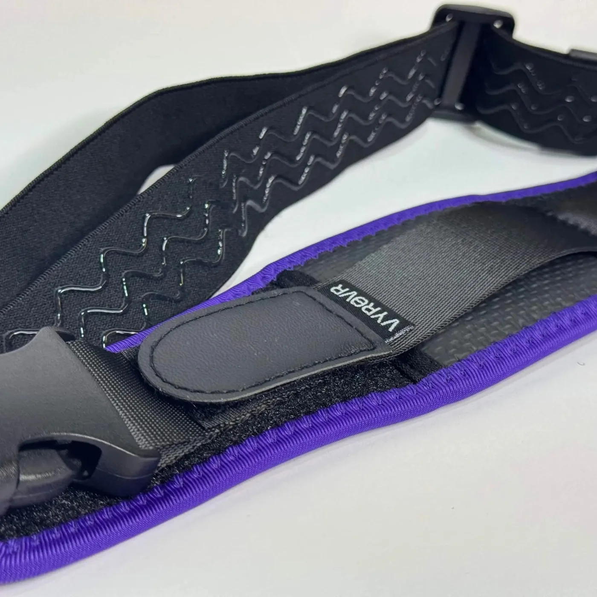

**Comfort straps** and **premium straps** are two names for the same product: VYRO VR's own neoprene strap line, currently at revision **R2**. They come in every **Premium** IBIS set and are sold separately as the **VYRO VR Comfort Strap Bundles** (Core / Advanced / Full Body / Essential variants — trackers not included) or as individual pieces. Standard sets ship with the [basic straps](/straps/basic-straps/) instead.

## What's different from the basic straps

| | Basic straps | Comfort / Premium (R2) |
|---|---|---|
| Body strap | 30 mm silicone-backed elastic velcro | 25 mm silicone-backed elastic (30 mm hip, 38 mm chest) with neoprene padding |
| Closure | Velcro + plastic quick-release hook | **Magnetic buckles** (plastic buckles on the hip and chest) |
| Tracker mount | Slide-in plastic tray | 25 mm non-elastic polyester mounting strap (30 mm on the hip) — holds the tracker flatter and more securely |
| Chest | Harness with mount | VYRO VR Chest Harness, adjustable both sides and shoulders, supports back mounting |
| Warranty | — | 1 year |

The R2 revision added the polyester tracker mount, slimmed down the neoprene, and reworked the chest mounting.

## Pieces and sizes

| Piece | Max fit | Included in |
|---|---|---|
| VYRO VR Chest Harness | 135 cm around the chest | Premium sets, Core/Advanced/Full Body bundles |
| VYRO VR Hip Harness | 160 cm | Premium sets, bundles |
| VYRO VR Thigh Straps (pair) | 85 cm | Premium sets, bundles |
| VYRO VR Ankle/Arm Straps (pair) | 45 cm | Premium sets, bundles; a second pair for arms in Full Body |

| Ankle / arm straps | Thigh straps | Hip harness | Chest harness |
|---|---|---|---|
|  |  |  |  |

Premium Advanced and Full Body sets add 2 × 35 cm basic foot straps, because foot trackers still use the tray system. Individual R2 ankle, arm, thigh, and hip pieces are sold on their own at [vyrovr.com](https://vyrovr.com), as is the lighter [Chest Harness Lite](/straps/chest-harness/).

## Fitting a comfort strap

1. Feed the tracker into the polyester mounting strap on the front of the pad, USB-C port down, and snug the mounting strap so the tracker can't rotate.
2. Wrap the neoprene pad around the limb with the silicone-backed elastic against your skin.
3. Click the magnetic buckle together (the hip and chest use plastic buckles) and pull the tail to adjust.
4. Tighten until the tracker doesn't shift when you flex, but you can still slide a finger underneath. See [Wearing Safely](/safety/wearing-safely/).
5. To take it off, pop the buckle — no need to readjust next time.

:::note
Step-by-step photos are coming. If anything is unclear, the Discord has a pinned thread with example photos.
:::

## Where each strap goes

See [Wearing Trackers](/straps/wearing-trackers/) for the body-part placement and orientation.

## Care

- Straps are **machine-washable on a cold cycle**. Take the trackers out first and close the buckles so they don't snag.
- Air dry — no dryer.
- Wipe the silicone backing with a damp cloth between washes.

## Troubleshooting

- **Tracker rotates in the mount:** tighten the polyester mounting strap, not the body strap
- **Strap slides down a thigh:** move it higher, where the leg is wider, and check the silicone backing is against skin, not clothing
- **Buckle pops open during play:** the strap is overstretched — go a size up on the hip/chest, or loosen slightly so the elastic isn't at its limit
