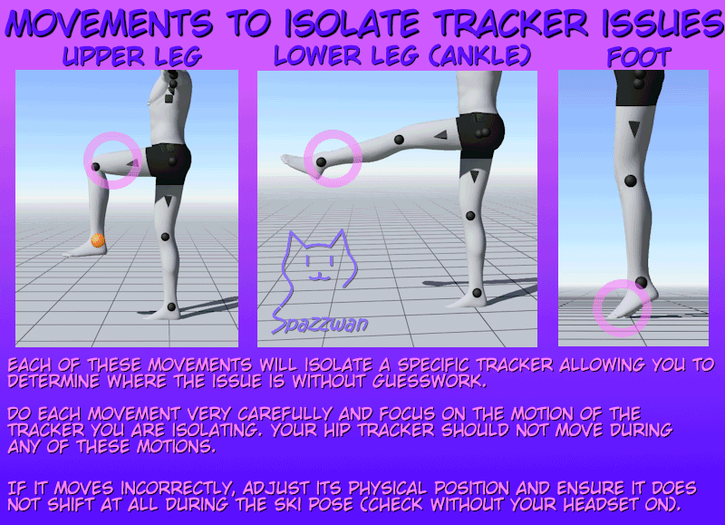

Drift is normal in any inertial tracking system, including SlimeVR. The question is "how often is it bad enough to be noticeable?" — and the answer should be "a yaw reset every ~10 minutes if you're dancing hard, around an hour or more if you're walking and socialising."

If you find yourself resetting every couple of minutes, something deeper is off.

## Quick checklist

1. **Did you full-reset at session start?** Stand straight, face forward, trigger full reset. Don't skip this.
2. **Is Stay Aligned on?** See [Stay Aligned](/firmware/stay-aligned/). It eliminates most yaw drift automatically.
3. **Are your body proportions correct?** Wrong torso length looks like drift even though it isn't. Re-run [AutoBone](/slimevr-server/body-proportions/).
4. **Did you run mounting calibration?** Without it, the server is guessing at orientation. Re-run [Mounting Calibration](/slimevr-server/mounting-calibration/).

## Common symptoms

### "My avatar is facing 10° off"

Trigger a **yaw reset**. If you have to do this every few minutes, enable [Stay Aligned](/firmware/stay-aligned/).

### "My feet are facing the wrong way" or "Knees bend backward"

Mounting on those trackers is wrong. Re-run [Mounting Calibration](/slimevr-server/mounting-calibration/) with the trackers worn correctly (USB ports down, on a spot where muscle movement doesn't shift them, not on a joint).

### "My avatar is leaning forward / hunched"

The hip tracker has shifted or rotated since mounting calibration, or your torso proportions are off. Re-check placement on [Wearing Trackers](/straps/wearing-trackers/), re-run mounting calibration, then AutoBone.

### "One leg is drifting much faster than the other"

A single tracker's gyro bias may have wandered. Run **side calibration** on it — two button presses with the tracker resting on a flat surface, wait for the four rapid flashes (see [IBIS Overview](/trackers/ibis-overview/#side-calibration-2-presses)). If that doesn't help, swap its body-part assignment with a different tracker (e.g., move the left-thigh tracker to right-thigh). If the drift follows the tracker, that tracker is the problem — reach out via [support](/support/).

To work out *which* tracker is misbehaving without guessing, isolate it with a movement that only that tracker should respond to: lift a knee (upper leg), swing the lower leg (ankle), or tilt a foot. Your hip tracker should not move during any of them.

*Infographic by [Spazzwan](https://imgur.com/a/PCYz9Zw), used with permission.*

### "Drift gets bad when I do fast turns"

This is normal in inertial tracking. Fast yaw motion accumulates errors. Mitigations: Stay Aligned, more frequent yaw resets, and a stationary moment between turns.

## When resets aren't fixing anything

If you reset, it looks right for a second, then immediately drifts again:

- Trackers shifted on the strap (re-tighten, re-do mounting calibration)
- Wrong body location assignment (swap two trackers — see [Assigning Trackers](/slimevr-server/assigning-trackers/))
- Receiver placement is so bad that a tracker is intermittently disconnecting — see [Range & Placement](/receiver/range-and-placement/)
